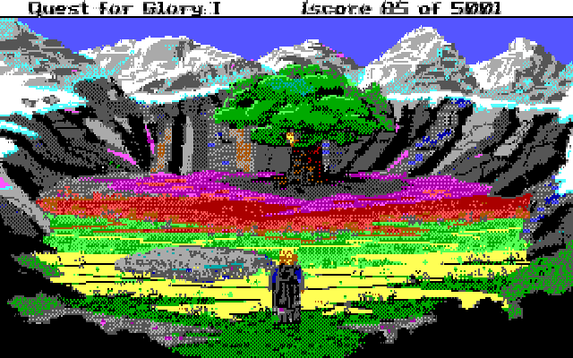

# CGA-16 Image Conversion

The Color Graphics Adapter (CGA) from the original IBM PC
had an undocumented mode that allows an unusual
640x200 16-color pseudo-graphics mode.

The mode, described by some as "ANSI from Hell",
is actually a variant on the 80x25 16-color
text mode in which an 80x100 grid of 8x2 characters
made up of the top 2 lines of the usual 8x8 character set
is used.

This project contains tools for converting images
to and from this format.
The data is saved in a 16k + 7 byte header format,
able to be BLOADed by GWBASIC into B800:0000.

It assumes you have the
[Farbfeld](https://tools.suckless.org/farbfeld/)
tools installed.

